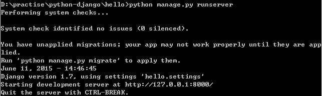

# 01 入门

-----
## 01 环境配置

1. Python安装版本：2.7.8 ，添加Python安装目录到环境变量
2. 下载`easy_install.py`执行安装。添加Scripts目录到环境变量
3. 执行`easy_install pip`安装包管理工具pip
4. 执行`pip install django=1.7`安装Django
5. 执行`pip install mssql`安装MSSQL包

## 02 创建项目

在工作目录下执行命令：`django-admin startproject mysite`创建目录：
```
mysite/
    __init__.py
    manage.py
    settings.py
    urls.py
```
文件如下：
+ __init__.py ：让 Python 把该目录当成一个开发包 (即一组模块)所需的文件。 这是一个空文件，一般你不需要修改它。

+ manage.py ：一种命令行工具，允许你以多种方式与该 Django 项目进行交互。 键入`python manage.py help`，看一下它能做什么。
你应当不需要编辑这个文件；在这个目录下生成它纯是为了方便。

+ settings.py ：该 Django 项目的设置或配置。 查看并理解这个文件中可用的设置类型及其默认值。

+ urls.py：Django项目的URL设置。 可视其为你的django网站的目录。 目前，它是空的。

## 03 启动项目：
执行命令：`python manage.py runserver`:


修改端口：`python manage.py runserver 9000`
